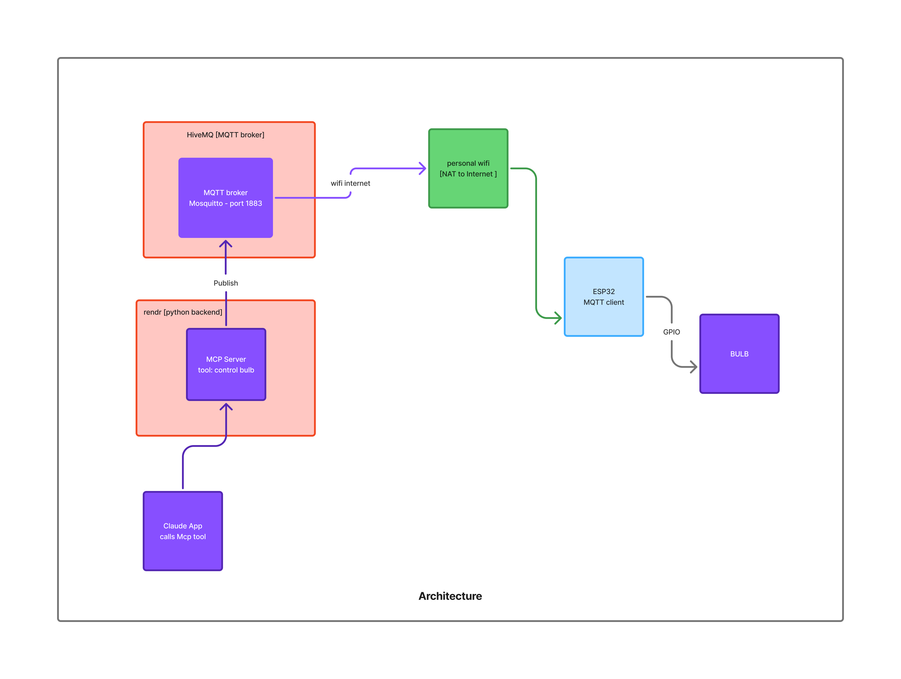

# MCP MQTT Bulb Server

MCP server with tools to control an ESP32 bulb via MQTT (HiveMQ Cloud compatible).

# Architecture


## What this server does

- Exposes MCP tools for light control.
- Publishes MQTT commands to your broker (for example, HiveMQ Cloud).
- Lets your assistant map natural-language requests to MQTT actions.

Example intent mapping:
- "turn on my home light" -> `control_bulb("ON")`
- "turn off the bulb" -> `control_bulb("OFF")`

## Setup

1. Create and activate a virtual environment:

   ```bash
   python3 -m venv .venv
   source .venv/bin/activate
   ```

2. Install dependencies:

   ```bash
   pip install -r requirements.txt
   ```

3. Copy env template and update values:

   ```bash
   cp .env.example .env
   ```

4. Update `.env`:

   - `MQTT_HOST` = your broker host
   - `MQTT_PORT` = `8883` for TLS
   - `MQTT_USERNAME` = broker username
   - `MQTT_PASSWORD` = broker password
   - `MQTT_CONTROL_TOPIC` = command topic (default `home/bulb/control`)
   - `MQTT_STATUS_TOPIC` = status topic (default `home/bulb/status`)
   - `MQTT_USE_TLS` = `true` for cloud brokers

5. Run MCP server:

   ```bash
   python server.py
   ```

### Local transport notes

- Default transport is `stdio` (good for local MCP clients).
- For cloud/web hosting (Render), use:

   ```bash
   MCP_TRANSPORT=streamable-http python server.py
   ```

## Tools exposed

- `control_bulb(action)`
  - Accepts `ON` or `OFF` (case-insensitive)
  - Publishes to `MQTT_CONTROL_TOPIC`
  - Use for natural-language light control requests

- `publish_raw(topic, payload, qos=1, retain=False)`
  - Publishes any payload to any topic

- `get_config()`
  - Returns non-sensitive runtime config summary

## Notes

- Keep `.env` private. Do not commit credentials.
- Rotate broker password if it was shared publicly.
- ESP32 should subscribe to the same control topic configured here.

## Deploy on Render (important)

If Render shows **"Application exited early"**, it usually means the server was
started in `stdio` mode and then exited (no stdio client attached).

Use Streamable HTTP mode on Render:

- `MCP_TRANSPORT=streamable-http`
- The app auto-binds to `0.0.0.0:$PORT`

This is already configured in [render.yaml](render.yaml).
